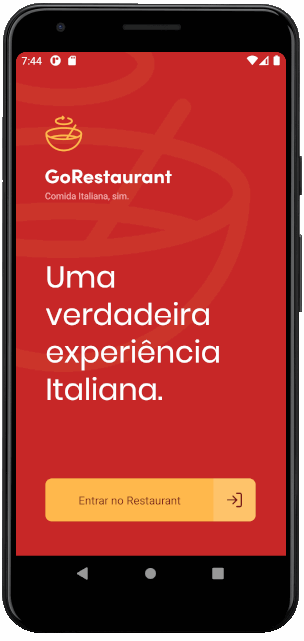

# 📕 Indice

- [Apresentação](#-apresentação)
- [Sobre](#-sobre)
- [Tecnologias utilizadas](#-tecnologias-utilizadas)
- [Como Baixar o projeto](#-como-baixar-o-projeto)

# 🚀 Apresentação

<div style="display: flex; flex-direction: 'row';">
  

  

  


</div>

<h1>
  

</h1>

## 🧰 Sobre

Projeto **Go Restaurant** foi criado dentro do curso Bootcamp GoStack com intuito de colocarmos em prática todo contéudo estudado durante o curso.

---

## 🚀 Tecnologias utilizadas

O projeto foi desenvolvido as seguintes tecnologias

- [React Native](https://reactnative.dev)
- [Axios](https://github.com/axios/axios)
- [Styled Components](https://styled-components.com)

---

## 💻 Como Baixar o projeto

```bash
# Clone do projeto:
$ git clone https://github.com/douglasdsda/Delivary-react-native.git

yarn json-server server.json -p 3333

adb reverse tcp:3333 tcp:3333

# ir para pasta
$ cd Delivary-react-native

# instalar as dependencias
$ yarn install

# iniciar react native em uma aba
$ yarn start

# Iniciar api fake
yarn json-server server.json -p 3333

# Se for android usar esse comando para iniciar local host
adb reverse tcp:3333 tcp:3333

# Iniciar android
$ yarn android / yarn ios

# Iniciar ios
$ pod install && yarn ios

```

---

Desenvolvido por Douglas Souza
